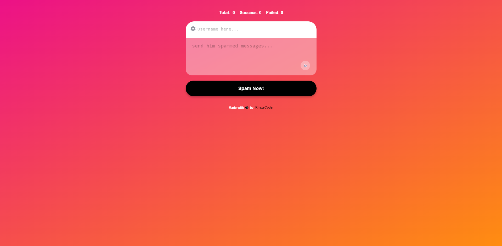

***NGL BOMBER PRO***
=
<br>

### Introduction
------------
Do you want to get noticed by your crush or simply have some fun with your friends? Look no further! Ngl Bomber is the perfect project for you. This tool allows you to send multiple messages to users, making it a fun way to grab attention or play harmless pranks. Whether you're trying to stand out or just looking for a good laugh, Ngl Bomber has got you covered. Dive in and start sending those messages!

Watch Demo Video Below:
[](https://youtu.be/heawRuLL9rk)

**Modes**
- Normal(anonymous)
- Confessions
- 3 Words
- Never Have
- TBH
- Ship Me
- Your Crush
- Cancelled
- Deal BReaker
- Random

<br>

### Requirements
------------
To deploy locally you need to install the following
1. [git](https://git-scm.com/book/en/v2/Getting-Started-Installing-Git "git")
2. [node](https://nodejs.org/en "node")
3. [react](https://reactjs.org/ "react")

<br>

### Installation
------------
```bash
git clone https://github.com/RhazeCoder/ngl-bomber
```
```bash
cd ngl-bomber
```
```bash
npm install
```
<br>

### Starting
------------
To run the project, run in split terminal
- Server
```bash
cd server
```
```bash
npm run dev
```

<br>

- Client
```bash
npm run start
```
<br><br>

----------

***Coded with 🖤 by RhazeCoder***